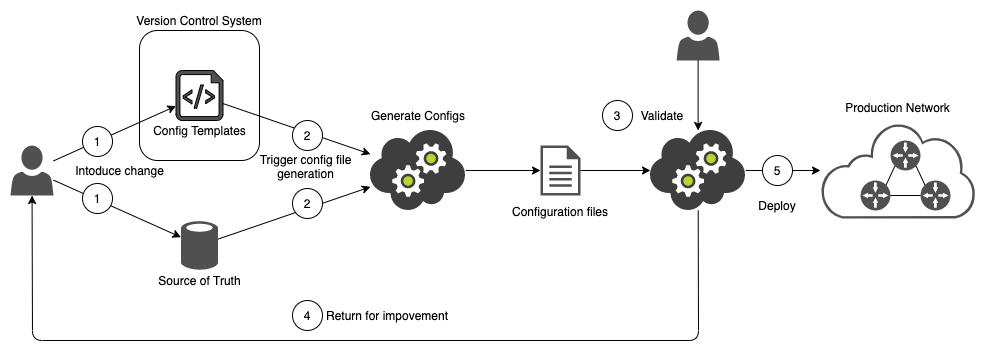

# NetDevOps

Now that you've read the previous section you should guess that NetDevOps is just a DevOps approach applied to networking. All of the aforementioned key DevOps practices can be aligned with the network: device configurations can be templated (IaC) and put into a version control system where CI/CD processes are applied.

Below is the sample diagram representing the whole process.

<figure markdown>
  
  <figcaption>NetDevOps Pipeline</figcaption>
</figure>

The workflow starts with a network operator introducing a change (1) either to the *Source of Truth* or to the *configuration templates*. So what are those exactly?

**Source of Truth** is a database (e.g. SQL DB or plain text files) where constants such as VLAN numbers and IP addresses are stored. Actually, this can be several databases &mdash; you can get your IP information from [IPAM](https://en.wikipedia.org/wiki/IP_address_management) and interface descriptions from [DCIM](https://en.wikipedia.org/wiki/Data_center_management#Data_center_infrastructure_management) ([Netbox](https://netbox.readthedocs.io/en/stable/) is a great example that can do both). The key idea here is that each database must be the [single source of truth](https://en.wikipedia.org/wiki/Single_source_of_truth) for the particular piece of information, so when you need to change something you change it only in one place.

**Configuration templates** are just text files written in a templating language of choice (I guess [Jinja2](https://jinja.palletsprojects.com/en/2.11.x/) is the most popular one). When combined with the info from the SoT they produce device-specific config files. Templating allows you to break down device configurations into separate template files each one representing a specific config section and then mix and match them to produce configurations for different network devices. Some templates may be reused across multiple devices and some may be created for specific software versions or vendors.

Making changes to the SoT or the templates triggers (2) the rest of the process. First, both those sources of information are used by the configuration management system (e.g. Ansible, more on this later) to generate the resulting configuration files to be applied to the network devices. These configs then must be validated (3). Validation usually includes several automated tests (syntax check, use of [modeling software](https://www.batfish.org/), spinning up virtual devices) and a peer review. If validation fails some form of feedback is given to the initiator of change (4) so they can remediate and start the whole process again. If validation is passed resulting configs can be deployed to the production network (5).

Of course, the presented workflow is rather schematic and aims to give a general idea of the network automation process and the role of the core components in it.

In the next section, I'm going to look at the tools and technologies one can utilize in network automation workflows.